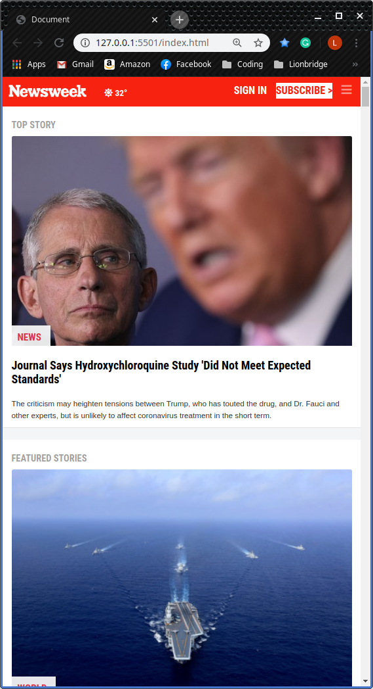
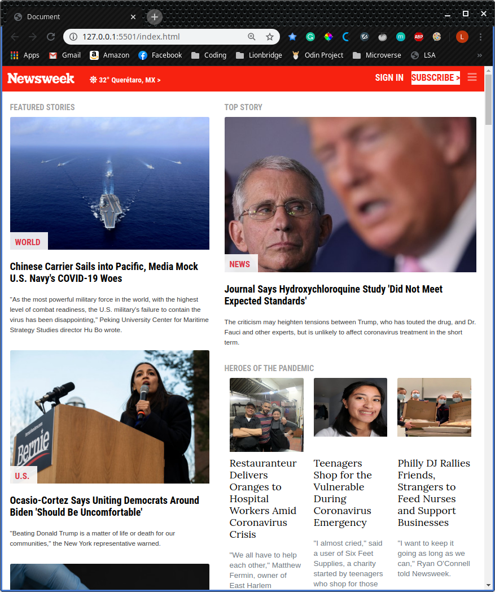
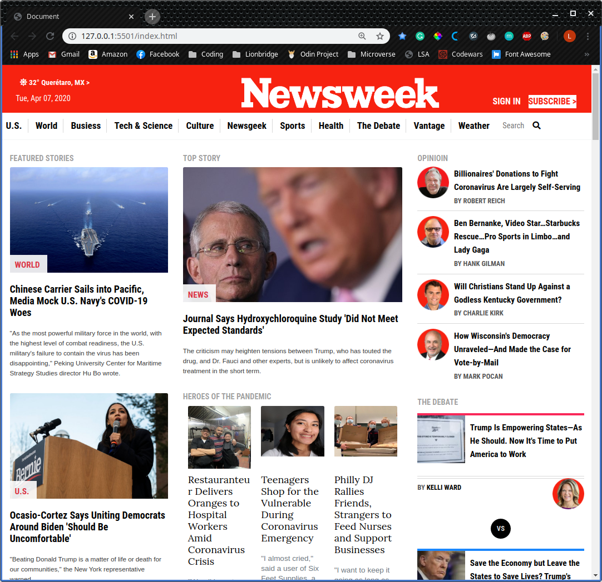

# Newsweek clone: Bootstrap!

> In this project, I worked on making a whole website using the Bootstrap Framework. I worked on the elements we had seen previously such as Grid and Flexbox, and I included Media Queries to be able to make the website look exactly as the original for different screen sizes. I also worked with background images complete project that includes all the knowledge previously acquired and the Bootstrap classes.







The original website includes some responsive elements that needed some Javascript and JQueries to work so that I was not able to copy those with the exact functionality as in the original website.

## Live version

[Live Version](https://rawcdn.githack.com/lmaldonadoch/newsweek-clone/0ecf1a726f4b8934d396c85e27ffd5a147d680fb/index.html)

## Built With

- Bootstrap
- HTML
- CSS
- Google fonts
- Font Awesome

## Getting Started

To get a local copy of the repository please run the following commands on your terminal:

```
$ cd <folder>
```

```
$ git clone git@github.com:lmaldonadoch/newsweek-clone.git
```

## Author

👤 **Luis Angel Maldonado**

- Github: [@lmaldonadoch](https://github.com/lmaldonadoch)
- Twitter: [@LuisAngelMCh](https://twitter.com/LuisAngelMCh)
- Linkedin: [linkedin](https://www.linkedin.com/in/luis-angel-maldonado-5b503a1a3/)

## 🤝 Contributing

Contributions, issues and feature requests are welcome!

Feel free to check the [issues page](https://github.com/Jmagero/smashing-magazine/issues).

## Show your support

Give a ⭐️ if you like this project!

## Acknowledgments

- Project originally taken from The Odin Project
- Project inspired by Microverse Program